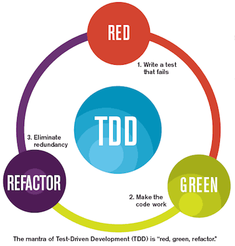

React Todo Application TDD Workflow

## React

```sh
npx create-react-app my-app
cd my-app
npm start
```

- props: immutable, all React components must act like pure functions with respect to their props
- state: is private and fully controlled by the component
- unidirectional or top-down data flow

## TDD

The test should drive the development.

  

- ### Unit tests

  - validate the functionality of isolated code

- ### Integration tests
  - verify the flow of data and the interaction of components
- ### End-to-End (E2E) tests
  - look at the behavior of the overall application.

## Jest

## Enzyme

Enzyme is a JavaScript Testing utility for React that makes it easier to test your React Components' output.

- #### Shallow 浅渲染 for unit test

  - Real unit test (isolation, no children render)

- #### Mount 全渲染 for intergration test

  - Full rendering including child components. Requires a DOM (jsdom, domino). More constly in execution time.

* #### Snapshot

  - toMatchSnapshot()
